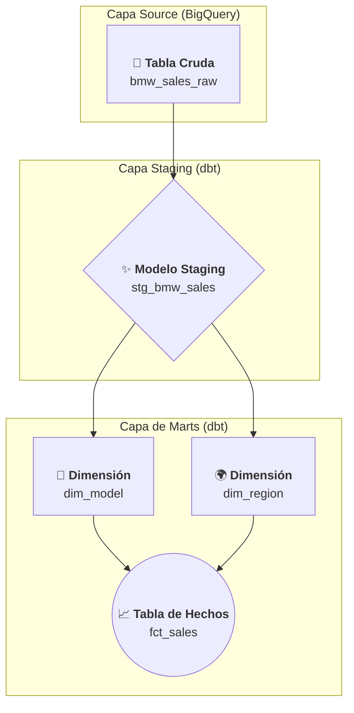

# 🚗 Proyecto de Analítica de Ventas de BMW

¡Bienvenido al proyecto de analítica de ventas de BMW! Este repositorio contiene un pipeline de datos construido con dbt que transforma datos crudos de ventas en un modelo de datos limpio, probado y listo para el análisis.

---

## 🏛️ Arquitectura del Proyecto

Este proyecto sigue una arquitectura de datos en capas, una práctica recomendada que promueve la modularidad, el mantenimiento y la calidad de los datos.

*   **Capa Staging (`models/staging`):** Es la primera capa de transformación. Su responsabilidad es limpiar los datos crudos:
    *   Renombra columnas a un formato estándar (`snake_case`).
    *   Estandariza los tipos de datos (`CAST`).
    *   Genera una clave subrogada (`sale_id`) para identificar de forma única cada fila.
    *   El modelo principal aquí es `stg_bmw_sales`.
    *   Define el punto de entrada de los datos crudos. Apunta a la tabla `bmw_sales_raw` en BigQuery, actuando como el contrato de datos inicial.(`sources`)

*   **Capa de Marts (`models/staging/marts`):** Es la capa final, diseñada para el consumo por herramientas de Business Intelligence (BI) o analistas. Implementa un **esquema de estrella** para facilitar las consultas.
    *   **Tablas de Dimensiones (`dim_`):** Describen las entidades de negocio. Ej: `dim_model`, `dim_region`.
    *   **Tabla de Hechos (`fct_`):** Contiene las métricas cuantitativas y las claves foráneas a las dimensiones. Ej: `fct_sales`.

---

## 🌊 Flujo de Datos

El siguiente diagrama ilustra cómo los datos fluyen y se transforman a través de las capas del proyecto, desde la fuente cruda hasta el modelo de datos final.



---

## 📖 Definiciones de Modelos

> Cada modelo representa una tabla o vista en el data warehouse, con un propósito específico.

| Modelo         | Descripción                                                              |
| :------------- | :----------------------------------------------------------------------- |
| `stg_bmw_sales`  | Modelo de staging que limpia y prepara los datos de ventas de BMW.       |
| `dim_model`      | **Dimensión:** Contiene una fila única por cada combinación de atributos de un vehículo (modelo, año, color, etc.). |
| `dim_region`     | **Dimensión:** Contiene una fila única por cada región de venta.         |
| `fct_sales`      | **Hechos:** Tabla central que registra cada venta, con métricas y claves foráneas a las dimensiones. |

---

## 📊 Métricas Clave

Este pipeline expone las siguientes métricas listas para ser analizadas:

*   **Precio de Venta (`price_usd`):** El precio de cada venta en USD. Permite analizar ingresos, precios promedio por modelo, región, etc.
*   **Volumen de Ventas (`sales_volume`):** El volumen asociado a cada transacción.
*   **Conteo de Ventas:** Se puede derivar fácilmente contando las filas en la tabla `fct_sales`.

---

## ⚙️ Setup Reproducible

Sigue estos pasos para configurar y ejecutar el proyecto en tu entorno local.

### 1. Prerrequisitos

*   **dbt Core instalado:** Instrucciones de instalación.
*   **Acceso a Google BigQuery:** Debes tener credenciales configuradas para acceder a BigQuery.
*   **Perfil de dbt:** Configura tu archivo `~/.dbt/profiles.yml` con un perfil llamado `bmw_analytics`.

    <details>
    <summary>Ejemplo de <code>profiles.yml</code> para BigQuery</summary>

    ```yaml
    bmw_analytics:
      target: dev
      outputs:
        dev:
          type: bigquery
          method: service-account # o oauth
          project: fluid-mind-476121-g8
          dataset: dbt_produccion # El dataset donde se crearán los modelos
          threads: 4
          keyfile: /ruta/a/tu/keyfile.json # si usas service-account
    ```
    </details>

### 2. Instalación del Proyecto

```bash
# 1. Clona el repositorio
git clone https://github.com/J-Lopez-IICG/bmw_analytics.git
cd bmw_analytics

# 2. Instala las dependencias de dbt (ej: dbt_utils)
dbt deps
```

### 3. Ejecución y Pruebas

Una vez configurado, puedes ejecutar el pipeline y validar los datos con los siguientes comandos:

```bash
# Construye todos los modelos (vistas y tablas) en BigQuery
dbt run

# Ejecuta todas las pruebas de calidad de datos definidas en los archivos .yml
dbt test
```

¡Y listo! Tus datos estarán transformados y validados en BigQuery.

